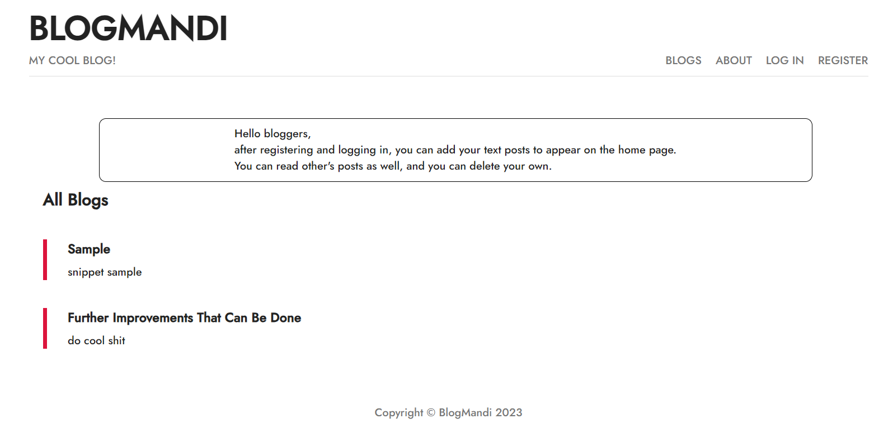
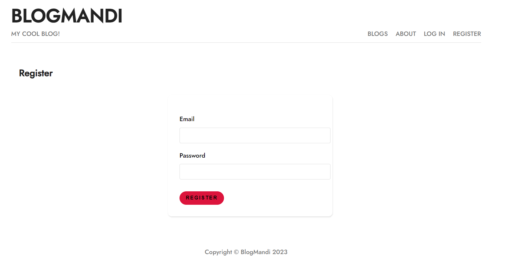
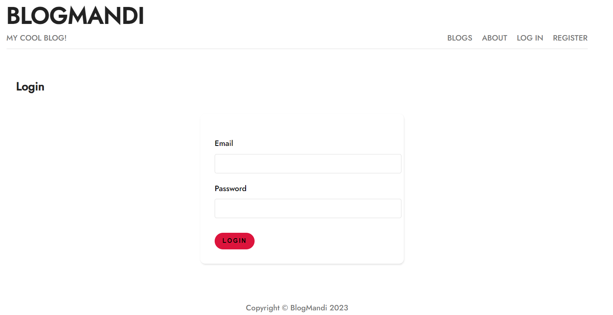
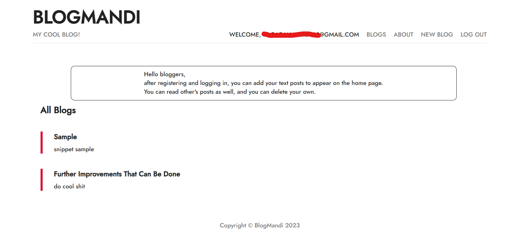
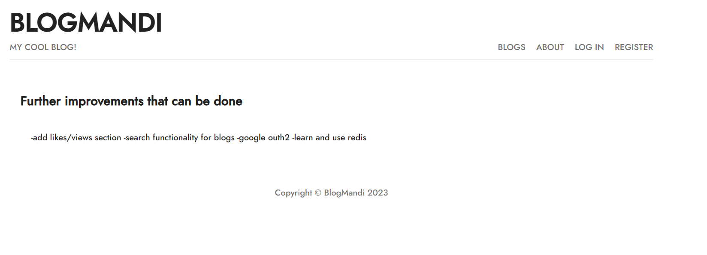

# Mandi Blog

A simple blog application built using Node.js, Express, and EJS, allowing users to create, view, and manage blog posts. Users can sign up, log in, and delete their own blogs using JWT (JSON Web Tokens) for authentication.

## Features

- **Blog Posts**: Users can browse all blog posts on the "Blogs" page.
- **User Authentication**: Users can sign up, log in, and manage their blogs. JWT is used for secure authentication.
- **New Blog Post**: Logged-in users can create new blog posts using the "New Blog" page.
- **Delete Blog**: Users can delete their own blogs individually.
- **About Page**: Provides information about the website.

## Technologies Used

- **Node.js**: Backend runtime environment for executing JavaScript.
- **Express.js**: Web framework used for managing routing, requests, server-side logic, and responses.
- **EJS (Embedded JavaScript)**: Template engine for rendering dynamic HTML content.
- **MongoDB**: Database used for storing blog posts and user data.
- **Mongoose**: ODM library for MongoDB, making it easier to manage data.
- **JWT (JSON Web Tokens)**: Used for secure user authentication.
  
## Project Structure
```
PLANT-DISEASE-CLASSIFICATION
│   ├── node_modules/         # Node.js dependencies.
│   ├── public/               # Public static assets like CSS and images.
│   │   ├── css/              # Stylesheets for styling the app.
│   │   │   └── styles.css    # Main CSS file for custom styles.
│   │   └── images/           # Images for the app (e.g., example disease images).
│   ├── src/                  # Source code for the application.
│   │   ├── controllers/      # Controllers handling the application logic.
│   │   │   ├── modelController.js   # Handles model predictions.
│   │   │   └── imageController.js   # Manages image processing.
│   │   ├── middleware/       # Middleware for additional processing.
│   │   │   └── authMiddleware.js     # Middleware for authentication (if applicable).
│   │   ├── models/           # Database models.
│   │   │   ├── Disease.js    # Mongoose model for diseases.
│   │   │   └── User.js       # Mongoose model for users (if applicable).
│   │   ├── routes/           # Route definitions for API endpoints.
│   │   │   ├── apiRoutes.js  # API routes for predictions and data retrieval.
│   │   │   └── userRoutes.js  # Routes for user-related actions (if applicable).
│   │   ├── utils/            # Utility functions.
│   │   │   ├── imageUtils.js # Functions for image processing (e.g., resizing).
│   │   │   └── modelUtils.js # Functions for loading and using the model.
│   │   ├── app.js            # Main server application logic and routes.
│   │   └── config.js         # Configuration settings (e.g., environment variables).
│   ├── .env                  # Environment variables for sensitive data.
│   ├── .gitignore            # Specifies files to be ignored by Git.
│   ├── package.json          # Metadata and dependencies for the project.
│   ├── package-lock.json     # Lockfile for npm dependencies.
│   ├── README.md             # Project documentation and usage instructions.
│   └── demo.png              # Example image used in the project.
```

## Installation

1. Clone the repository:
   ```bash
   git clone https://github.com/HrudayGurijala/blogmandi
   ```
2. Navigate to the project directory:
   ```bash
   cd blogmandi
   ```
3.Install required dependencies
  ```bash
  npm install
  ```

## Running the Application

1. Set up environment variables in a `.env` file:

   ```bash
   JWT_SECRET="your_jwt_secret"
   MONGO_URI="your_mongodb_connection_string"
   ```

2. Start the server:

   ```bash
   node app.js
   ```

3. Open your browser and navigate to:
   [http://localhost:3000](http://localhost:3000)

## Usage

1. Sign up or log in using the authentication system.
2. Create a new blog post using the "New Blog" page.
3. Browse all blogs on the "Blogs" page.
4. Logged-in users can delete their own blog posts.
5. View additional information on the "About" page.

## Screenshots

### First glance


### Register page


### Login page


### After logging in


### View a blog


## Contributing

Feel free to fork this repository and submit a pull request if you want to contribute to this project.

## License

This project is licensed under the MIT License.

## Contact

If you have any questions, feel free to reach out:

- **Email**: [gurijalahruday@gmail.com](mailto:gurijalahruday@gmail.com)
   
